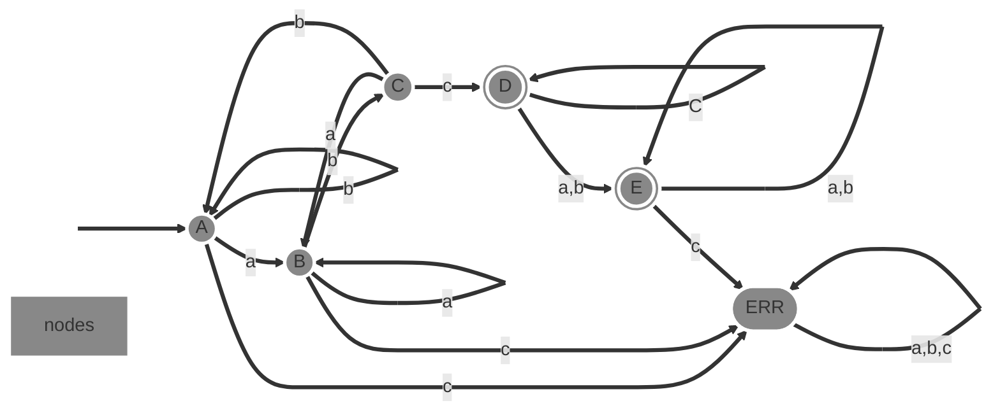
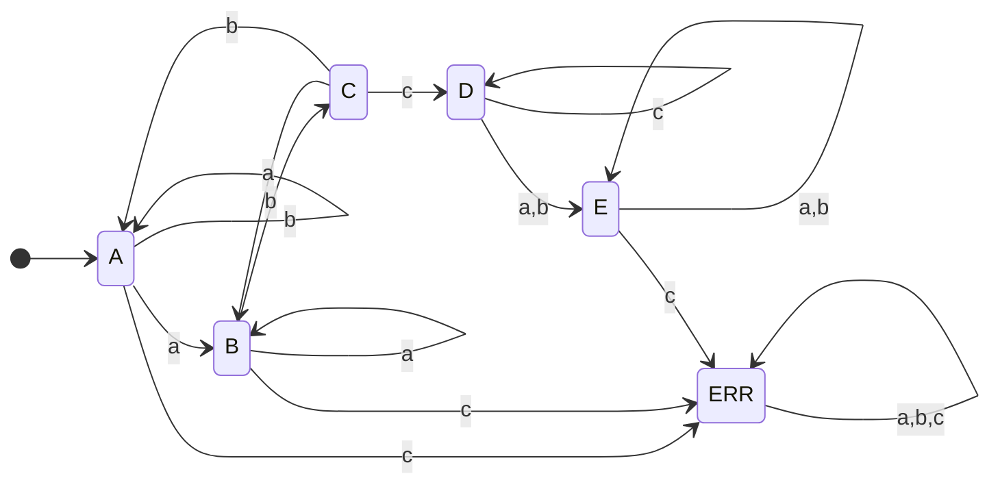
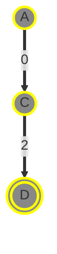
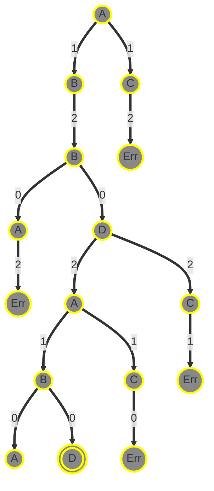
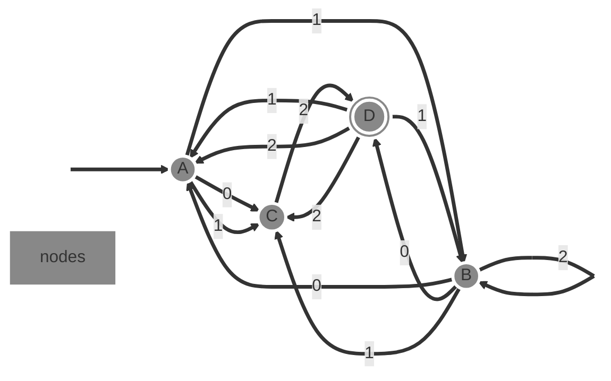
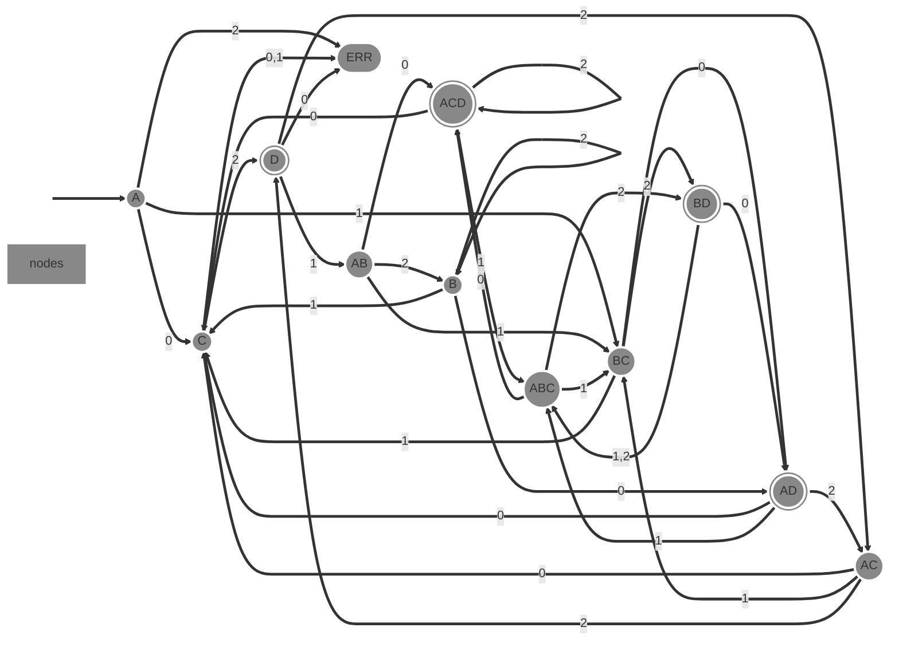

Página
1
de 6
# Parcial
0. Escribe en Elixir una **función** que reciba una lista de números enteros, y
que regrese una nueva lista de listas. Cada sublista contiene 3 elementos:
el número original, el número en negativo y el inverso del número. El
inverso de $n$ es $1/n$. Ejemplo:
Entrada: `[3, 7, -2, -1]`
Salida: `[[3, -3, 0.333], [7, -7, 0.1428], [-2, 2, -0.5], [-1, 1, -1.0]]`
0. Realiza la demostración por inducción de la siguiente propiedad para valores de
$n \ge 1$:
$\sum_{i=1}^n (i \cdot i!) = (n + 1)! - 1$
**SOLUTION**
**I. Basis** if $n = 1$
$\sum_{i=1}^1 (i \cdot i!) = (1 + 1)! - 1$
$1 \cdot 1! = (1 + 1)! - 1$
$1 \cdot 1 = (1 + 1)! - 1$
$1 = (1 + 1)! - 1$
$1 = (2)! - 1$
$1 = 2 - 1$
$1 = 2 - 1$
$1 = 1$
**II. Inductive Hypothesis** if $n = k$
$\sum_{i=1}^k (i \cdot i!) = (k + 1)! - 1$
**II. Inductive Step** if $n = (k + 1)$
$\sum_{i=1}^{k+1} (i \cdot i!) = ((k + 1) + 1)! - 1$
$\sum_{i=1}^k (i \cdot i!) + (k + 1)\cdot (k + 1)! = ((k + 1) + 1)! - 1$
$(k + 1)! - 1 + (k + 1)\cdot (k + 1)! = ((k + 1) + 1)! - 1$
$(1 + (k + 1))(k + 1)! - 1 = ((k + 1) + 1)! - 1$
$((k + 1) + 1)(k + 1)! - 1 = ((k + 1) + 1)! - 1$
$((k + 1) + 1)! - 1 = ((k + 1) + 1)! - 1$
$\square$
0. Define **(de manera recursiva | usando expresiones regulares | mediante un
DFA)**
el lenguaje en $\Sigma = \{a, b, c\}$ que contiene $abc$, y dónde las $c$
sólo pueden aparecer después de otra $c$.
**SOLUTION**
Recursive definition:
- I. Basis: $abc \in L$
- II. Recursive Step: If $u \in L$ then $au \in L$, $bu \in L$, $ua \in L$,
$ub \in L$. If $u = xc$, then $uc \in L$
- III. Closure: $u \in L$ only if it can be obtained from the basis using
a finite number of applications of the recursive step.
Regex: $\{a, b\}*abc\{c\}*\{a, b\}*$
State diagram:


Transition table:
State | a | b | c
:-----:|:---:|:---:|:---:
A |B|A|ERR
B |B|C|ERR
C |B|A|D
D |E|E|D
E |E|E|ERR
ERR |ERR|ERR|ERR
# Final
1. En base al siguiente **autómata finito deterministico**, evalua si los
siguientes strings son aceptados o no: `02`, `120210`, `012012`
$M = ($ { $A, B, C, D$ }$, $ { $0, 1, 2$ }$, \delta, A, $ { $D$ }$)$
State | 0 | 1 | 2
:-----:|:-----:|:-----:|:-----:
A |{C}|{B, C}|-
B |{A, D}|{C}|{B}
C |-|-|{D}
D |-|{A, B}|{A, C}
**SOLUTION** Derivation tree `02`

**SOLUTION** Derivation tree `120210`

0. Converte el anterior **autómata finito no-deterministico** en su equivalente
**deterministico**.
**SOLUTION** State diagram

**SOLUTION** DFA
State | 0 | 1 | 2
:-----:|:-----:|:-----:|:-----:
A | C | BC | ERR
C | ERR | ERR | D
BC | AD | C | BD
D | ERR | AB | AC
AD | C | ABC | AC
BD | AD | ABC | ABC
AB | ACD | BC | B
AC | C | BC | D
ABC | ACD | BC | BD
ACD | C | ABC | ACD
B | AD | C | B
**SOLUTION** State diagram

0. Escribe una **expresión regular** para identificar placas del DF o del estado de
méxico.
https://es.wikipedia.org/wiki/Matr%C3%ADculas_automovil%C3%ADsticas_de_M%C3%A9xico#
Nueva_denominaci%C3%B3n
**SOLUTION**
DF: antes: `\d{3}-[A-Z]{3}`, ahora: `[A-Z]-\d{3}-[A-Z]{3}`
Estados: `[A-Z]{3}-\d{3}-[A-Z]`
0. Escribe la sintaxis de la estructura **switch en C/C++** en **BNF** y **EBNF**.
**SOLUTION**
```xml
<switch> ::=
```
```bash
SWITCH ::=
